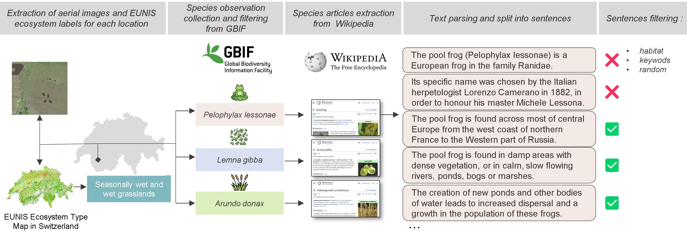
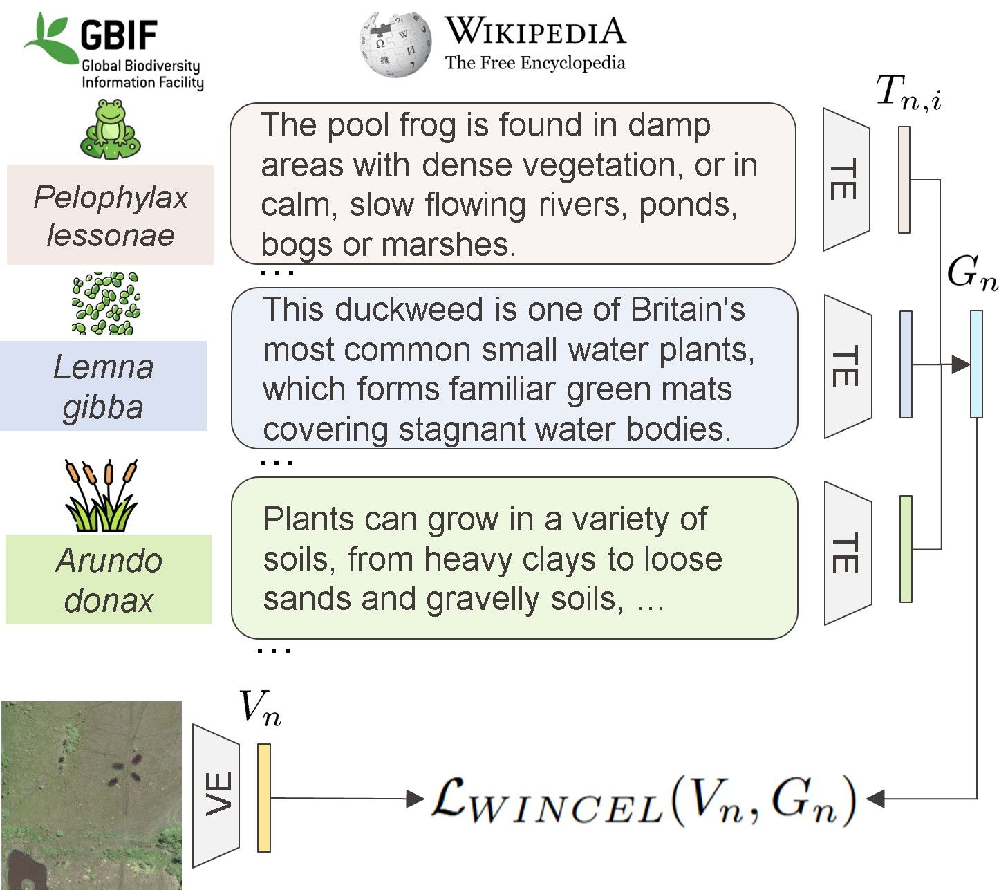
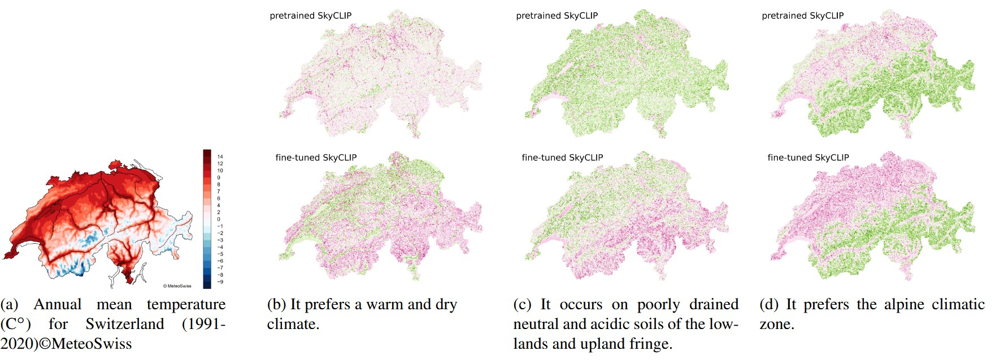
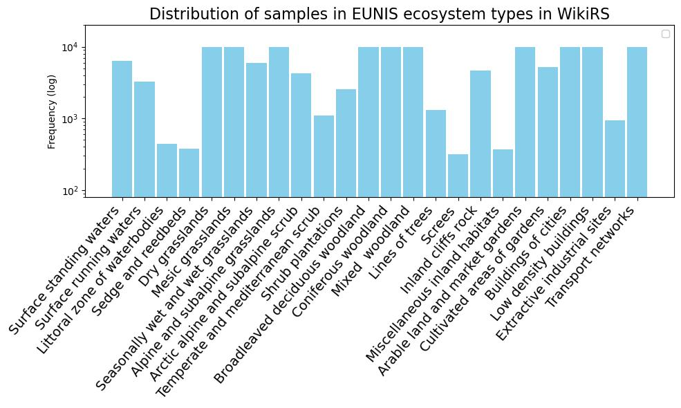
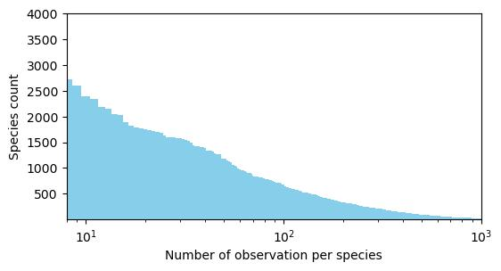
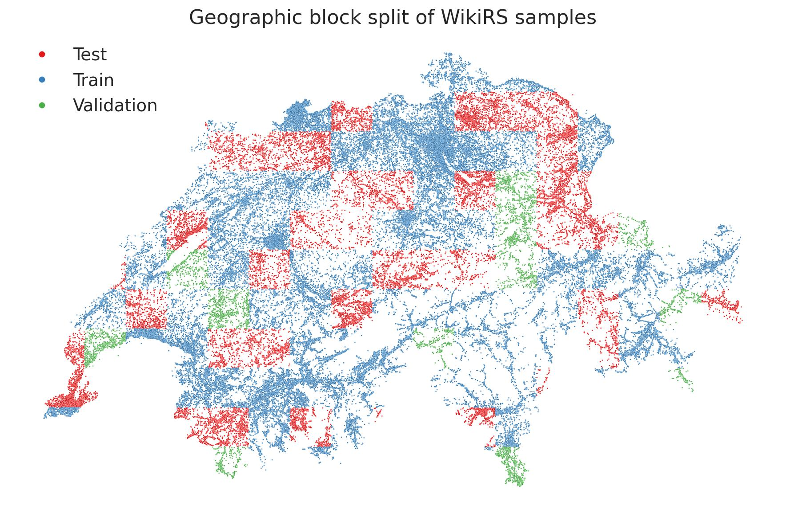

<h1 style="text-align: center;"> :frog: :herb: EcoWikiRS: Learning Ecological Representation of Satellite Images from Weak
Supervision with Species Observations and Wikipedia</h1>

<a href="https://orcid.org/0009-0008-1527-3913">Valerie Zermatten </a>,<a href="https://orcid.org/0000-0001-5607-4445"> Javiera Castillo-Navarro </a>,<a href="https://orcid.org/0000-0002-1731-8993">Pallavi Jain </a>,<a href="https://orcid.org/0000-0003-0374-2459"> Devis Tuia</a>
<a href="https://orcid.org/0000-0001-5607-4445"> Diego Marcos </a>


[](https://arxiv.org/abs/2504.19742)
[](https://huggingface.co/datasets/Silin1590/VinaBench)
[](https://zenodo.org/records/15236742)


<h2>News</h2>

April 2025 : :tada: :tada: EcoWikiRS was accepted for publication in the **EARTHVISION 2025 Workshop** in conjuction with the **Computer Vision and Pattern Recognition (CVPR) 2025 Conference**.


How to cite the work : 

```
@InProceedings{Zermatten_2025_WikiRS,
    author    = { Zermatten, Valerie and Castillo-Navarro, Javiera and Jain, Pallavi   and Tuia, Devis and Marcos, Diego},
    title     = {EcoWikiRS: Learning Ecological Representation of Satellite Images from Weak
Supervision with Species Observations and Wikipedia},
    booktitle = {Proceedings of the IEEE/CVF Conference on Computer Vision and Pattern Recognition (CVPR) Workshops},
    month     = {June},
    year      = {2025},
    pages     = {00-00}
}
```


<h3>Code requirements </h3>

We use python 3.10 with pytorch 2.2.0 and cuda 12.1. 
Required Python packages are listed in the requirements.yml which can be used to build a conda environment by following the instruction below : 

```
conda env create --file environment.yml python==3.10
conda activate wikirs
```


<h3>Model training</h3>

All the argument are described more in detail in the argparser function in the ``utils/argparser.py`` file. The following command line is an example to launch experiement of our best model :
```
# train model with WINCEL loss, SkyCLIP pretrained model : 
python train_multi_text.py --criterion WINCEL --model SkyCLIP 
```
More training options  are provided in the `run.sh` file.

<h2>Overview</h2>


We propose a method to **learn ecological properties of aerial images** by learning an alignement with species habitat descriptions. 


- We release the **EcoWikiRS** dataset, composed of triplets :
    - high-resolution aerial images (50cm, RGB bands)
    - a list of species observations collected from [**GBIF**](https://www.gbif.org/), geolocated within the footprint of the aerial image. 
    - sentences describing the habitat of the observed species, extracted  from the corresponding **Wikipedia** article.


<p align="center">

</p>

- We propose **WINCEL**, a weighted version of the InfoNCE loss. The aim of WINCEL is 
to recognize text passages that are relevant to the image from the descriptions. WINCEL filters out text that may describe properties that are specific only to part of the
species’ niche or is irrelevant to a specific image. 


<p align="center">

</p>

Formally, WINCEL is computed as follows : 


$L_{WINCEL}(V_n,G_n) = - \log \frac{ \exp{  ( V_n \cdot G_n / \tau} )}{ \sum_{j=1}^{N} \exp{( V_n \cdot G_j / \tau)} }$

where  


$G_n =  \sum_{i=0}^K  \sigma( V_n \cdot T_{n,i} / \tau)  \cdot T_{n,i}$

We evaluate our approach in the task of ecosystem zero-shot classification by following the habitat definitions from the European Nature Information System (EUNIS). Our results show that our approach helps in understanding RS images in a more ecologically meaningful manner.


<h2>Visual results</h2>

We generate visual features with both the pretrained and the fine-tuned SkyCLIP model and plot the **cross-modal** **similarity** on the surface of Switzerland (one image of 100 m by 100m per km2). 

<p align="center">

</p>

For plots (b), (c) (d), we observe that the maps generated by the fine-tuned models correctly highlights the warmest region, plateau and coldest regions of Switzerland,  which we assess by using the temperature map (a) as proxies.


We also have  cool numerical results: :tada:

- The proposed WINCEL approach is better than InfoNCE for fine-tuning GeoRSCLIP, SkyCLIP and CLIP, illustrating its capacity to focus on more useful sentences during training.

- We trained using different sets of passages from Wikipedia articles, including sentences from the **habitat** section, based on a set of **keywords** and  **random** sentences.  Passages from the “habitat” section consistently outperform the other approaches, highlighting the importance of quality over quantity for improving model performance.

Checkout the paper to learn more ! 


    


<h2>WikiRS dataset </h2>
The EcoWikiRS dataset can be retrieved from zenodo: 

[](https://doi.org/10.1016/j.isprsjprs.2025.01.006)


-  The EUNIS ecosystem type map for Switzerland with a spatial resolution of 100m comprehends a final set of 25 habitats. 
<p align="center">

</p>

- Distribution into EUNIS ecosystem types of samples from the WikiRS dataset on a log scale.
<p align="center">

</p>

- Number of observations per species in our dataset after filtering. Most species were observed very few times, whereas a few species were observed over 1000 times.
<p align="center">

</p>


- The distribution of our training samples across Switzerland is separated into 
between training (60%), testing (30%) and validation (10%) sets following a **block split**
approach with a size of 20 km.
<p align="center">

</p>


<h4>Additional Data information </h4>

- More information of the EUNIS ecosystem type map are available on the European Environment Agency website :  [**Ecosystem type map** (all classes)](https://www.eea.europa.eu/en/analysis/maps-and-charts/ecosystem-type-map-all-classes-1).

- The  raw aerial images with 10cm resolution  from the swissIMAGE product can be  openly downloaded from the [swisstopo website ](https://www.swisstopo.admin.ch/de/orthobilder-swissimage-10-cm)


<h2>Contributing</h2>

If you are interested in contributing to one of the aforementioned points or working on a similar project and wish to collaborate, please reach out to [ECEO](https://www.epfl.ch/labs/eceo).

For code-related contributions, suggestions or inquiries, please open a GitHub issue. 


<h2>Code acknowledgments</h2>

We acknowledge the following code repositories that were useful throughout the WikiRS  project :  

- The [open_clip repository](https://github.com/mlfoundations/open_clip).
- The [RemoteCLIP repository](https://github.com/ChenDelong1999/RemoteCLIP).
- The [GeoRSCLIP repository](https://github.com/om-ai-lab/RS5M).
- The [SkyCLIP repository](https://github.com/wangzhecheng/SkyScript).


- The following medium blog post was very useful for extrating and parsing Wikipedia articles ['**Wikipedia Data Science**: Working with the World’s Largest Encyclopedia'](https://medium.com/data-science/wikipedia-data-science-working-with-the-worlds-largest-encyclopedia-c08efbac5f5c).

- Check out :taco: [**TACOSS**](https://github.com/eceo-epfl/RS-OVSS), my previous work on text-based semantic segmentation of aerial images.


Other smaller ressources are mentioned in the relevant code sections. 
